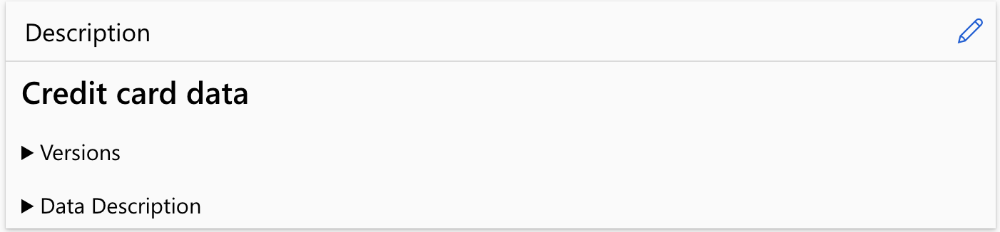
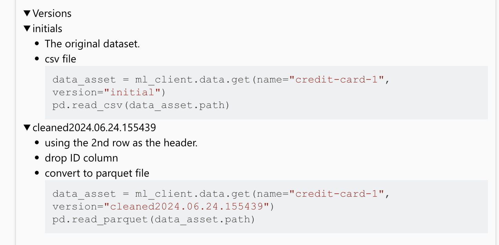
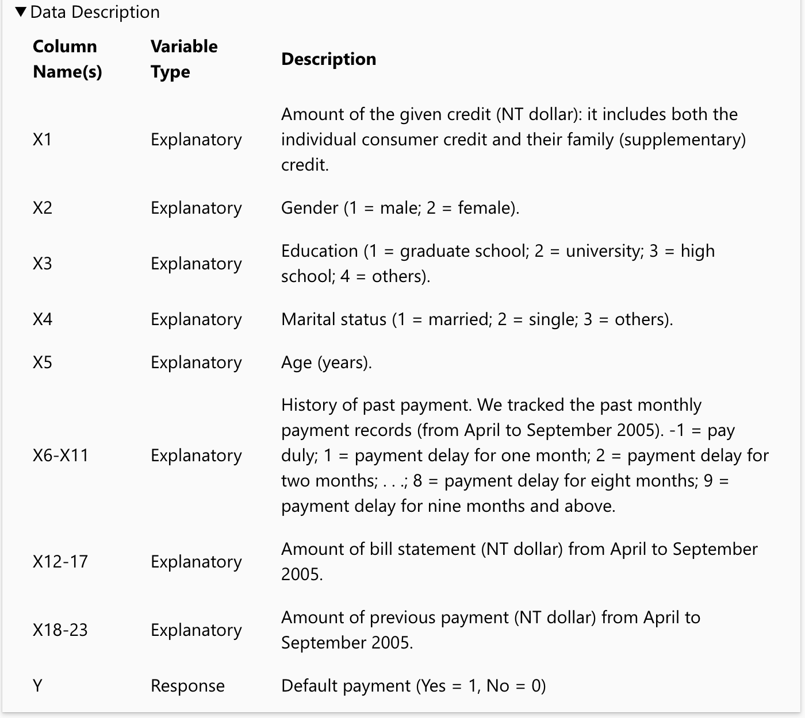

## data assets name and version parameter are required. so you must check the data asset and find the right version of the data asset before using get method.

## after creating data asset, the data will be stored on workspace datastore workspaceblobstore.

- The original csv file or parquet file can be removed.
- It is better practice to remove the orginal data file after creating data assets.
  - save storage cost.
  - avoid data file redundancy. The data asset is the only one source of the data.
- This data uploaded to your workspace's default datastore named workspaceblobstore

## use pandas read_csv(file_path) to read data into a dataframe

- file_path is the path of data assets

## Immutable

- Once you create a data asset version, it is immutable. It cannot be modified or deleted.
- data asset version is immutable.
- Existing version can't be overwriten.
- You can archive the data assets that you don't need.
- The only way to delete data assets is to delete the resource group.

## Versions

- If you don't give a customised version string when creating the first version of data assets, the version number will be automatically set to 1, 2, 3 ...
- If you give a customised version string when creating the first version of dataq assets, the version won't be automatically update and you have to provide a version string every time.

## Trackable

- can track the asset versions, who updated a version, and when the version updates occurred.
- For any given data asset, you can view which jobs or pipelines consume the data.

## azureml.fsspec

- azureml.fsspec is a package that allows you to access Azure Machine Learning defined URIs as if they were a file system1

## utilize description section to add data set information

- Version details
  

- Data description

  

## add a time value, so that each time this code is run, a different version number will be created.
